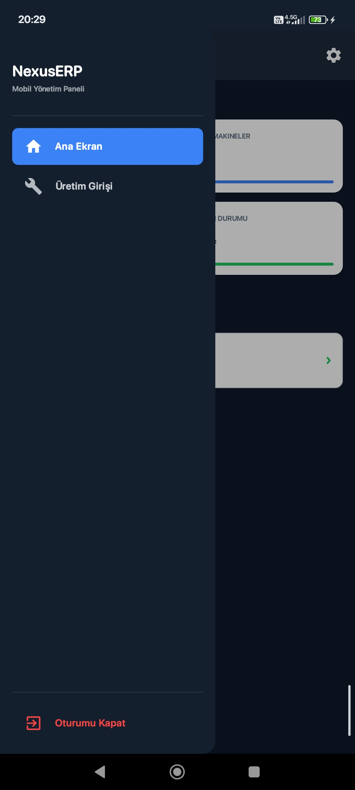
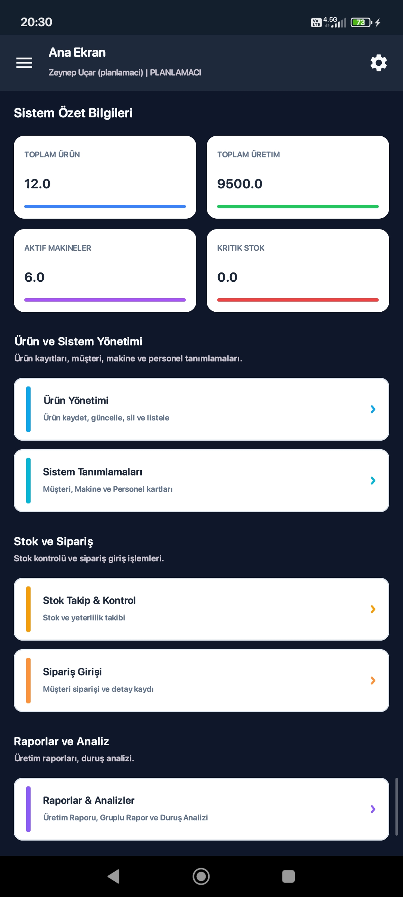
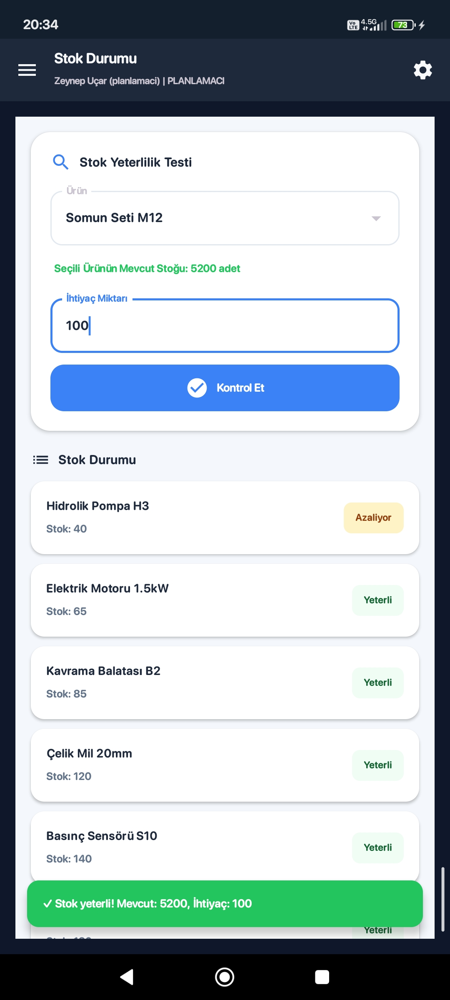
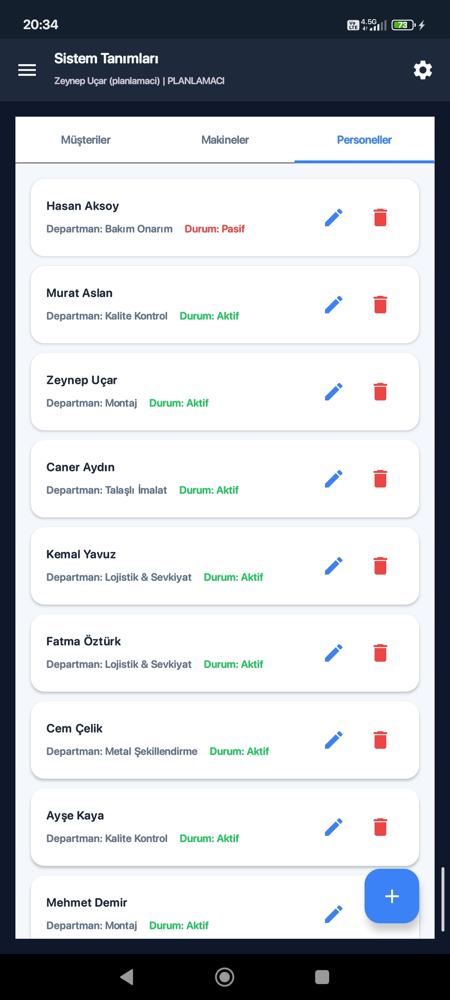
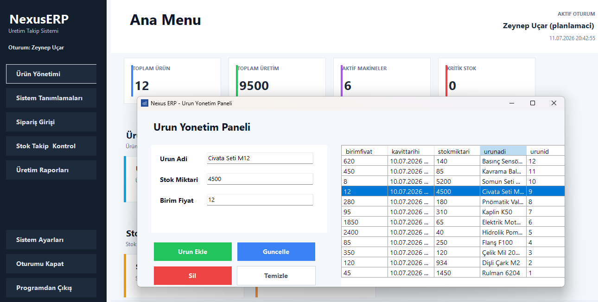
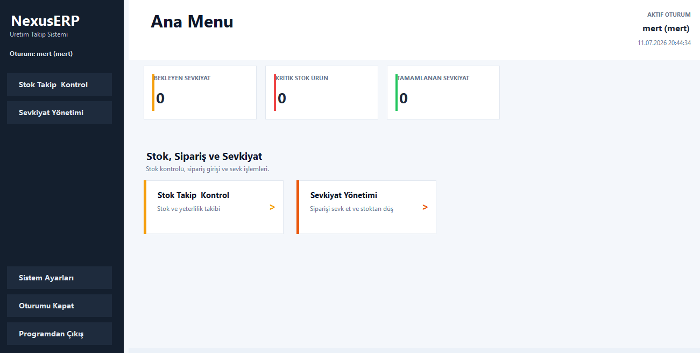
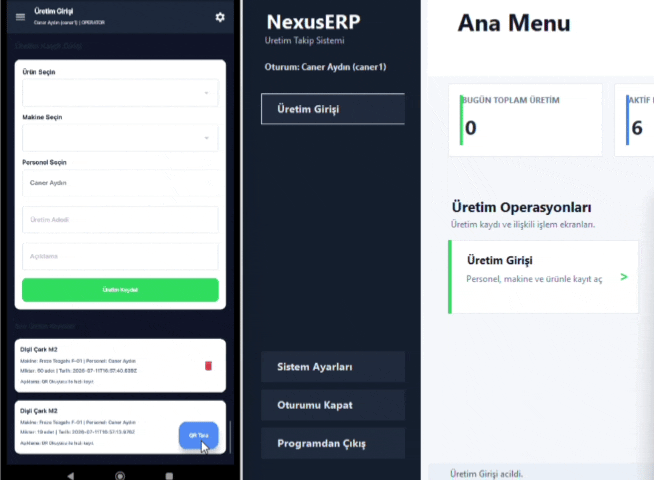

# NexusERP - Çoklu Platform Üretim Takip ve Yönetim Ekosistemi

**NexusERP** endüstriyel üretim yapan bir işletmenin saha operasyonlarını, stok yönetimini, sipariş sevk süreçlerini ve makine verimlilik analizlerini uçtan uca yöneten, çoklu platform (Multi-Platform) ve rol tabanlı çalışan bir kaynak planlama sistemidir.

Uygulama basit bir CRUD projesinin ötesinde, farklı çalışma ortamlarına sahip üç bağımsız istemcinin tek bir merkezi veritabanı ve iş mantığı katmanı etrafında senkronize şekilde çalışmasını sağlayan bütünsel bir sistem mimarisidir.

---

## Sistem Mimarisi & Teknoloji Yığını

Sistem, servis odaklı bir mimariyle tasarlanmıştır. Tüm istemciler (Mobile & Desktop) iş mantığından tamamen yalıtılmış olup, veri işlemlerini ve kontrollerini merkezi bir REST API üzerinden gerçekleştirir.

```text
┌──────────────────────────────────┐      ┌──────────────────────────────────┐
│  Android Mobile Client (Kotlin)  │      │   Windows Desktop Client (C#)    │
│ [Jetpack Compose, Retrofit, UDF] │      │     [HttpClient, Async Engine]   │
└─────────────────┬────────────────┘      └─────────────────┬────────────────┘
                  │                                         │
                  │             (HTTP / REST)               │
                  └────────────────────┬────────────────────┘
                                       ▼
┌────────────────────────────────────────────────────────────────────────────┐
│                    Java Backend (Spring Boot REST API)                     │
│               [Merkezi Validasyon, Domain Logic, ORM Katmanı]              │
└──────────────────────────────────────┬─────────────────────────────────────┘
                                       │
                                       ▼
┌────────────────────────────────────────────────────────────────────────────┐
│                    Neon Tech Cloud PostgreSQL Database                     │
└────────────────────────────────────────────────────────────────────────────┘

```

---

## Özellikler

### Java API (Backend)

* **Merkezi Validasyon**: Stok düşümleri, sevk durumları ve üretim girişleri için gerekli tüm kurallar backend üzerinde yönetilir. Bu sayede yetersiz stok veya hatalı işlemlerde sistem anında müdahale ederek veri bozulmalarını engeller.


* **Veri İlişkileri ve Modelleme**: Üretim, ürün, sipariş, makine ve kullanıcı domainleri arasındaki karmaşık SQL ilişkileri Hibernate ORM katmanı ile optimize edilmiştir ve veritabanı seviyesinde veri bütünlüğü sağlanır.


### Android Mobil Uygulama

* **Barkod ve QR Okuyucu**: Saha operatörlerinin manuel veri girişi hatasını sıfıra indirmek amacıyla, cihaz kamerası Google ML Kit ile entegre edilmiştir. Barkodlar çalışma zamanında taranarak doğrudan API'ye gönderilir.


* **Tek Yönlü Veri Akışı (UDF)**: Jetpack Compose arayüzü, StateFlow mekanizmaları kullanılarak MVVM mimarisiyle beslenir. Ağ isteklerinin durumları (Yükleniyor, Başarılı, Hata) reaktif olarak takip edilir.


### Windows Desktop Paneli

* **Asenkron Ağ İletişimi**: İdari personelin kullandığı yönetim panelinde, ana arayüzü kilitlemeden arka planda HTTP isteklerini yöneten asenkron bir iletişim katmanı yer alır.


* **Rol Tabanlı Dinamik Arayüz**: Giriş yapan personelin rolüne (Admin, Planlamacı, Operatör, Sevkiyatçı) göre ekranlar dinamik olarak şekillenir. Operatör için kritik alanlar kilitlenirken, planlamacı için analiz modülleri aktif olur.


### İş Akışları ve Süreç Yönetimi

* **Stok ve Sevkiyat Doğrulama**: Sipariş sevk edilirken sistem veritabanındaki stok miktarını kontrol eder. Stok yeterliyse otomatik düşüm yapılır, yeterli değilse işlem iptal edilerek kullanıcıya hata mesajı dönülür.


* **Makine Duruş Analizi**: Fabrika sahasındaki makinelerin çalışma, durma veya arıza durumları loglanarak masaüstü ve mobil ekranlardaki panellerde raporlanır.


---

## Kullanılan Teknolojiler

* **Spring Boot & Java 17**: Merkezi REST API servislerinin ve iş mantığının geliştirilmesinde kullanıldı.


* **PostgreSQL**: Sistem verilerinin bulut ortamında (Neon Tech) güvenli ve ilişkisel olarak saklanmasını sağladı.


* **Jetpack Compose & Kotlin**: Saha operatörlerinin kullandığı modern mobil uygulamanın geliştirilmesinde kullanıldı.


* **Google ML Kit**: Mobil cihaz kamerası üzerinden yüksek performanslı barkod tarama işlemleri için entegre edildi.


* **C# & .NET Windows Forms**: İdari yönetim ve planlama panelinin asenkron mimariyle masaüstünde çalışmasını sağladı.


---

## Mimari

Sistem, servis odaklı ve katmanlı bir mimariyle geliştirilmiştir. Mobil (Kotlin) ve masaüstü (C#) istemciler veriye doğrudan erişmek yerine, tüm validasyon ve domain kurallarını yürüten merkezi Spring Boot API katmanıyla konuşur. Bu sayede gelecekteki iş kuralı değişiklikleri istemcileri etkilemeden tek merkezden yönetilebilir.

---

## Öğrenilenler ve Deneyimler

* **Çoklu Platform Senkronizasyonu**: Android mobil uygulaması ile C# masaüstü uygulamasının aynı merkezi REST API ile asenkron ve tutarlı bir şekilde haberleşmesini sağlama deneyimi kazandım.


* **Donanım Entegrasyonu**: Google ML Kit kütüphanesini kullanarak mobil cihaz kamerasını bir barkod tarayıcı olarak uygulamaya entegre etmeyi ve saha veri girişlerini otomatikleştirmeyi öğrendim.


* **Merkezi İş Mantığı Yönetimi**: İş kurallarını istemci tarafında dağıtmak yerine tamamen backend katmanında soyutlayarak daha güvenli, tutarlı ve modüler sistemler tasarlamayı başarıyla uyguladım.


---

## Mobil Görseller

| | |
| :---: | :---: |
|  |  |
|  |  |

---

## Masaüstü Görselleri

| | |
| :---: | :---: |
|  |  |

---

## Demo (GIF)



---

## Nasıl Çalıştırılır?

### 1. Sunucu Katmanı

```bash
cd backend
mvn clean install
mvn spring-boot:run

```

### 2. Masaüstü Katmanı

* `client-desktop/NexusERP.slnx` çözüm dosyasını Visual Studio veya Rider ile açın.


* Bağımlılıkların yüklenmesinin ardından projeyi derleyip çalıştırın.


### 3. Mobil Katman

* `client-mobile/NexusERP` projesini Android Studio ile içeri aktarın.


* Gradle senkronizasyonunun ardından emülatör veya gerçek cihazda çalıştırın.